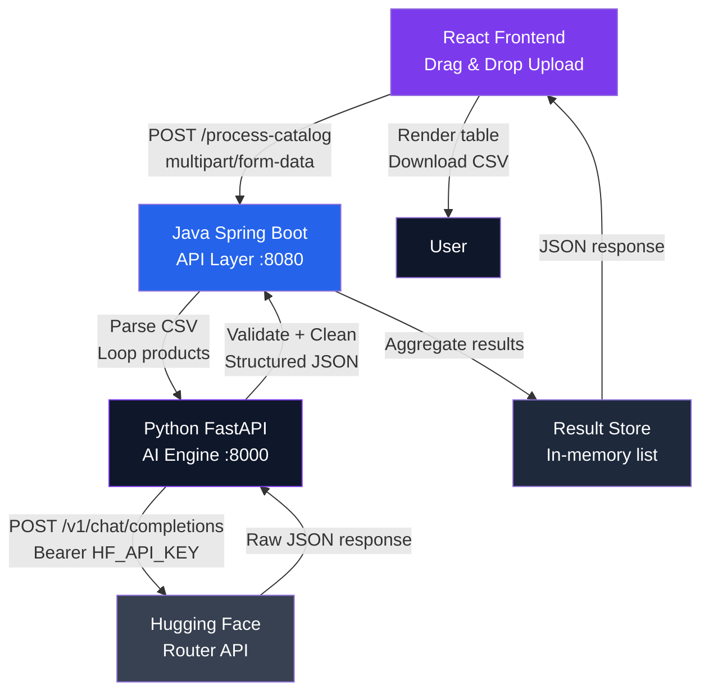
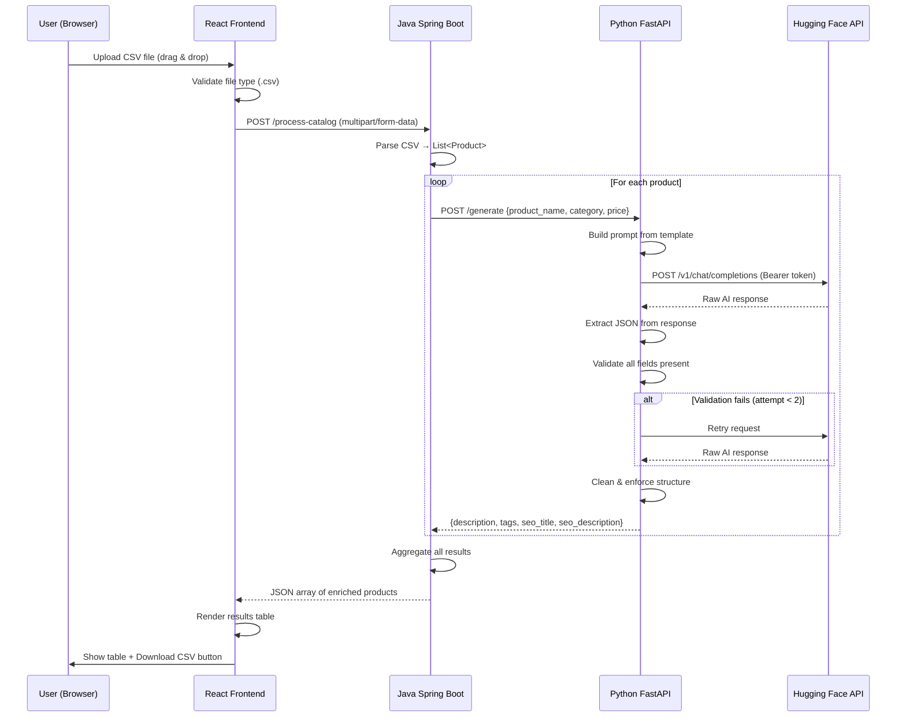
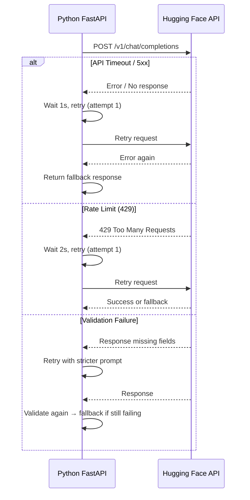

# Design Document: GenCatalog AI

## Overview

GenCatalog AI is a production-level AI SaaS web application that automates e-commerce catalog generation. Users upload a CSV file containing raw product data (name, category, price), and the system uses a multi-tier architecture — React frontend → Java Spring Boot API → Python FastAPI AI engine → Hugging Face Inference API — to generate professional product descriptions, tags, SEO titles, and SEO meta descriptions for each product, then delivers the enriched catalog as a downloadable CSV.

The system is designed for bulk processing with robust retry logic, output validation, and a premium dark-themed SaaS UI that provides real-time progress feedback during generation.

---

## Architecture



---

## Sequence Diagrams

### Main Processing Flow



### Error / Retry Flow



---

## Components and Interfaces

### Component 1: React Frontend

**Purpose**: Premium SaaS UI for file upload, progress tracking, results display, and CSV export.

**Interface**:
```typescript
interface UploadState {
  file: File | null
  isDragging: boolean
  isProcessing: boolean
  progress: number          // 0–100
  processingTime: number    // seconds
  error: string | null
}

interface EnrichedProduct {
  product_name: string
  category: string
  price: string
  description: string
  tags: string
  seo_title: string
  seo_description: string
}

interface CatalogResponse {
  products: EnrichedProduct[]
  total: number
  processing_time_ms: number
}
```

**Responsibilities**:
- Drag & drop CSV upload with file type validation
- Show animated progress bar during processing
- Render results in a sortable/scrollable table
- Export enriched data as downloadable CSV
- Display user-friendly error messages

---

### Component 2: Java Spring Boot API Layer

**Purpose**: Accepts CSV uploads, orchestrates per-product AI generation calls to Python, and aggregates results.

**Interface**:
```java
// REST Endpoint
POST /process-catalog
Content-Type: multipart/form-data
Body: file (CSV)

// Response
{
  "products": [...],
  "total": int,
  "processing_time_ms": long
}

// Internal service interface
interface CatalogService {
    CatalogResponse processCatalog(MultipartFile file) throws CatalogProcessingException;
    List<Product> parseCsv(MultipartFile file) throws CsvParseException;
    EnrichedProduct callAiEngine(Product product) throws AiEngineException;
}
```

**Responsibilities**:
- Parse and validate incoming CSV (required columns: product_name, category, price)
- Iterate products and call Python `/generate` endpoint per product
- Handle HTTP errors from Python engine gracefully
- Aggregate enriched products into response payload
- Return processing time metadata

---

### Component 3: Python FastAPI AI Engine

**Purpose**: Receives product data, constructs prompts, calls Hugging Face API, validates/cleans AI output, and returns structured JSON.

**Interface**:
```python
# REST Endpoint
POST /generate
Content-Type: application/json
Body: {"product_name": str, "category": str, "price": str}

# Response (success)
{
  "description": str,
  "tags": str,
  "seo_title": str,
  "seo_description": str
}

# Response (fallback)
{
  "description": "Description unavailable",
  "tags": "",
  "seo_title": product_name[:59],
  "seo_description": "Product details coming soon."
}
```

**Responsibilities**:
- Build structured prompt from product fields
- Call Hugging Face router API with auth header
- Parse and extract JSON from AI response text
- Validate all required fields exist and meet constraints
- Clean output (strip symbols, trim whitespace)
- Retry up to 2 times on failure or validation error
- Return fallback on persistent failure

---

### Component 4: Hugging Face Inference API (External)

**Purpose**: LLM inference endpoint providing AI-generated catalog content.

**Configuration**:
```
URL:   https://router.huggingface.co/v1/chat/completions
Model: meta-llama/Meta-Llama-3-8B-Instruct
Auth:  Bearer ${HF_API_KEY}
```

---

## Data Models

### Product (Input)

```typescript
interface Product {
  product_name: string   // required, non-empty
  category: string       // required, non-empty
  price: string          // required, numeric string e.g. "299.99"
}
```

**Validation Rules**:
- All three fields must be present and non-empty
- `price` must be parseable as a positive number
- Rows failing validation are skipped with an error entry

---

### EnrichedProduct (Output)

```typescript
interface EnrichedProduct extends Product {
  description: string      // 80–150 words, plain text
  tags: string             // comma-separated, max 8 keywords
  seo_title: string        // max 60 characters
  seo_description: string  // max 160 characters
}
```

**Consistency Rules**:
- `description`: 80–150 words, no markdown, no special symbols
- `tags`: comma-separated list, 5–8 items, max 8
- `seo_title`: ≤ 60 characters, title-cased
- `seo_description`: ≤ 160 characters, sentence form

---

### AI Request Payload

```python
{
  "model": "meta-llama/Meta-Llama-3-8B-Instruct",
  "messages": [
    {
      "role": "user",
      "content": (
        "Generate structured output in JSON format for:\n"
        "Product Name: {product_name}\n"
        "Category: {category}\n"
        "Price: {price}\n\n"
        "Return ONLY a JSON object with keys: "
        "description, tags, seo_title, seo_description"
      )
    }
  ],
  "max_tokens": 300,
  "temperature": 0.7
}
```

---

## Algorithmic Pseudocode

### Main Catalog Processing Algorithm (Java)

```pascal
ALGORITHM processCatalog(csvFile)
INPUT: csvFile of type MultipartFile
OUTPUT: CatalogResponse

BEGIN
  startTime ← currentTimeMillis()

  products ← parseCsv(csvFile)
  ASSERT products IS NOT EMPTY

  results ← empty list

  FOR each product IN products DO
    ASSERT product.product_name IS NOT EMPTY
    ASSERT product.category IS NOT EMPTY
    ASSERT product.price IS VALID NUMBER

    TRY
      enriched ← callAiEngine(product)
      results.add(enriched)
    CATCH AiEngineException e
      fallback ← buildFallbackEntry(product, e.message)
      results.add(fallback)
    END TRY
  END FOR

  elapsedMs ← currentTimeMillis() - startTime

  RETURN CatalogResponse {
    products: results,
    total: results.size(),
    processing_time_ms: elapsedMs
  }
END
```

**Preconditions**:
- `csvFile` is non-null and non-empty
- CSV contains headers: product_name, category, price

**Postconditions**:
- Every input product has a corresponding output entry (enriched or fallback)
- `processing_time_ms` reflects actual wall-clock time

**Loop Invariant**: `results.size()` equals the number of products processed so far

---

### AI Generation Algorithm with Retry (Python)

```pascal
ALGORITHM generateProductContent(product, maxRetries=2)
INPUT: product {product_name, category, price}, maxRetries: int
OUTPUT: enriched {description, tags, seo_title, seo_description}

BEGIN
  attempt ← 0

  WHILE attempt <= maxRetries DO
    TRY
      prompt ← buildPrompt(product)
      rawResponse ← callHuggingFace(prompt)
      jsonData ← extractJson(rawResponse)

      IF validateFields(jsonData) THEN
        cleaned ← cleanOutput(jsonData)
        IF enforceConstraints(cleaned) THEN
          RETURN cleaned
        END IF
      END IF

    CATCH TimeoutError
      WAIT 1 second
    CATCH RateLimitError
      WAIT 2 seconds
    CATCH ApiError e
      LOG e.message
    END TRY

    attempt ← attempt + 1
  END WHILE

  RETURN buildFallback(product)
END
```

**Preconditions**:
- `product` has non-empty product_name, category, price
- `HF_API_KEY` is set in environment

**Postconditions**:
- Returns valid enriched object OR fallback object
- Never raises an unhandled exception to caller
- At most `maxRetries + 1` calls made to Hugging Face

**Loop Invariant**: `attempt` increases by 1 each iteration; loop terminates when `attempt > maxRetries`

---

### Output Validation Algorithm (Python)

```pascal
ALGORITHM validateFields(jsonData)
INPUT: jsonData (parsed dict or None)
OUTPUT: isValid (boolean)

BEGIN
  REQUIRED_KEYS ← ["description", "tags", "seo_title", "seo_description"]

  IF jsonData IS NULL OR NOT IS_DICT(jsonData) THEN
    RETURN false
  END IF

  FOR each key IN REQUIRED_KEYS DO
    IF key NOT IN jsonData THEN
      RETURN false
    END IF
    IF jsonData[key] IS EMPTY STRING THEN
      RETURN false
    END IF
  END FOR

  RETURN true
END
```

---

### Output Cleaning & Constraint Enforcement (Python)

```pascal
ALGORITHM cleanOutput(jsonData)
INPUT: jsonData (validated dict)
OUTPUT: cleaned (dict)

BEGIN
  cleaned ← {}

  // Clean description
  desc ← stripSymbols(jsonData["description"])
  desc ← normalizeWhitespace(desc)
  words ← splitWords(desc)
  IF length(words) < 80 THEN
    desc ← desc  // accept as-is, flag for retry upstream
  END IF
  IF length(words) > 150 THEN
    desc ← joinWords(words[0:150])
  END IF
  cleaned["description"] ← desc

  // Clean tags
  tagList ← splitByComma(jsonData["tags"])
  tagList ← [trim(t) FOR t IN tagList]
  tagList ← [t FOR t IN tagList IF t IS NOT EMPTY]
  IF length(tagList) > 8 THEN
    tagList ← tagList[0:8]
  END IF
  cleaned["tags"] ← joinByComma(tagList)

  // Clean SEO title
  title ← stripSymbols(jsonData["seo_title"])
  title ← trim(title)
  IF length(title) > 60 THEN
    title ← title[0:57] + "..."
  END IF
  cleaned["seo_title"] ← title

  // Clean SEO description
  seodesc ← stripSymbols(jsonData["seo_description"])
  seodesc ← trim(seodesc)
  IF length(seodesc) > 160 THEN
    seodesc ← seodesc[0:157] + "..."
  END IF
  cleaned["seo_description"] ← seodesc

  RETURN cleaned
END
```

---

### JSON Extraction Algorithm (Python)

```pascal
ALGORITHM extractJson(rawText)
INPUT: rawText (string from LLM response)
OUTPUT: jsonData (dict) OR null

BEGIN
  // Strategy 1: Direct JSON parse
  TRY
    RETURN jsonParse(rawText)
  CATCH JsonDecodeError
    // continue to next strategy
  END TRY

  // Strategy 2: Extract JSON block between first { and last }
  startIdx ← indexOf(rawText, "{")
  endIdx ← lastIndexOf(rawText, "}")

  IF startIdx >= 0 AND endIdx > startIdx THEN
    candidate ← rawText[startIdx : endIdx + 1]
    TRY
      RETURN jsonParse(candidate)
    CATCH JsonDecodeError
      // continue
    END TRY
  END IF

  // Strategy 3: Extract from markdown code block
  IF rawText CONTAINS "```json" THEN
    block ← extractBetween(rawText, "```json", "```")
    TRY
      RETURN jsonParse(trim(block))
    CATCH JsonDecodeError
      // continue
    END TRY
  END IF

  RETURN null
END
```

---

## Key Functions with Formal Specifications

### Python: `build_prompt(product) -> str`

**Preconditions**:
- `product.product_name` is non-empty string
- `product.category` is non-empty string
- `product.price` is non-empty string

**Postconditions**:
- Returns a string containing all three product fields
- Instructs model to return ONLY a JSON object
- Specifies all four required output keys

---

### Python: `call_hugging_face(prompt: str) -> str`

**Preconditions**:
- `HF_API_KEY` environment variable is set
- `prompt` is non-empty string

**Postconditions**:
- Returns raw response text from LLM on success
- Raises `TimeoutError` if request exceeds 30s
- Raises `RateLimitError` on HTTP 429
- Raises `ApiError` on other HTTP errors

---

### Java: `parseCsv(file: MultipartFile) -> List<Product>`

**Preconditions**:
- `file` is non-null, non-empty
- File content is valid UTF-8 CSV

**Postconditions**:
- Returns list of Product objects with all fields populated
- Skips rows missing required columns (logs warning)
- Throws `CsvParseException` if header row is missing required columns

**Loop Invariant**: All products added to result list have non-null product_name, category, price

---

### Java: `callAiEngine(product: Product) -> EnrichedProduct`

**Preconditions**:
- `product` is fully populated
- Python AI engine is reachable at configured URL

**Postconditions**:
- Returns `EnrichedProduct` with all four AI-generated fields
- Throws `AiEngineException` on HTTP error or timeout
- Never returns null

---

## Example Usage

### CSV Input (Phones.csv sample)

```
product_name,category,price
iPhone 15 Pro,Smartphones,999.99
Samsung Galaxy S24,Smartphones,849.99
Google Pixel 8,Smartphones,699.99
```

### Python AI Engine Request

```python
POST http://localhost:8000/generate
Content-Type: application/json

{
  "product_name": "iPhone 15 Pro",
  "category": "Smartphones",
  "price": "999.99"
}
```

### Python AI Engine Response

```python
{
  "description": "Experience the pinnacle of smartphone innovation with the iPhone 15 Pro. Crafted from aerospace-grade titanium, this powerhouse features Apple's A17 Pro chip delivering unprecedented performance. The advanced triple-camera system with 48MP main sensor captures stunning detail in any light. With ProMotion display technology and all-day battery life, the iPhone 15 Pro redefines what a smartphone can do for professionals and creatives alike.",
  "tags": "iPhone, Apple, Smartphone, 5G, Pro Camera, Titanium, A17 Pro, iOS",
  "seo_title": "iPhone 15 Pro – Titanium Smartphone",
  "seo_description": "Buy iPhone 15 Pro with A17 Pro chip, titanium design & pro camera system. Free shipping."
}
```

### Java API Request

```
POST http://localhost:8080/process-catalog
Content-Type: multipart/form-data
Body: file=@Phones.csv
```

### Java API Response

```json
{
  "products": [
    {
      "product_name": "iPhone 15 Pro",
      "category": "Smartphones",
      "price": "999.99",
      "description": "Experience the pinnacle...",
      "tags": "iPhone, Apple, Smartphone, 5G, Pro Camera, Titanium, A17 Pro, iOS",
      "seo_title": "iPhone 15 Pro – Titanium Smartphone",
      "seo_description": "Buy iPhone 15 Pro with A17 Pro chip..."
    }
  ],
  "total": 3,
  "processing_time_ms": 4821
}
```

---

## Correctness Properties

*A property is a characteristic or behavior that should hold true across all valid executions of a system — essentially, a formal statement about what the system should do. Properties serve as the bridge between human-readable specifications and machine-verifiable correctness guarantees.*

### Property 1: Complete output coverage

*For any* list of valid products parsed from a CSV, the CatalogResponse products array SHALL contain exactly one entry (enriched or fallback) for each input product.

**Validates: Requirements 3.1, 3.2, 3.3**

---

### Property 2: Description word count constraint

*For any* EnrichedProduct returned by the AI_Engine after cleaning, the word count of the description field SHALL be at most 150 words.

**Validates: Requirements 9.1**

---

### Property 3: Tag count constraint

*For any* EnrichedProduct returned by the AI_Engine after cleaning, the number of comma-separated items in the tags field SHALL be at most 8.

**Validates: Requirements 9.2**

---

### Property 4: SEO title length constraint

*For any* EnrichedProduct returned by the AI_Engine after cleaning, the character length of the seo_title field SHALL be at most 60.

**Validates: Requirements 9.3**

---

### Property 5: SEO description length constraint

*For any* EnrichedProduct returned by the AI_Engine after cleaning, the character length of the seo_description field SHALL be at most 160.

**Validates: Requirements 9.4**

---

### Property 6: Retry attempt bound

*For any* product generation request, the total number of calls made to the HF_API SHALL be at most 3 (1 initial + 2 retries), regardless of the failure mode.

**Validates: Requirements 6.4**

---

### Property 7: API key never exposed

*For any* HTTP response produced by the API or AI_Engine, the response body and headers SHALL NOT contain the value of HF_API_KEY.

**Validates: Requirements 11.2, 11.3**

---

### Property 8: Fallback completeness

*For any* product for which all retry attempts are exhausted, the returned Fallback object SHALL contain all four required fields (description, tags, seo_title, seo_description) with non-empty string values.

**Validates: Requirements 6.5**

---

### Property 9: JSON extraction round-trip

*For any* valid JSON object containing the four required keys, serializing it to a string and then applying the extractJson algorithm SHALL produce an equivalent object.

**Validates: Requirements 7.1, 7.2, 7.3**

---

### Property 10: CSV parse completeness

*For any* well-formed CSV with required columns, parsing then re-serializing each row SHALL preserve the product_name, category, and price values without loss or mutation.

**Validates: Requirements 2.1**

---

### Property 11: Invalid output triggers retry

*For any* LLM response that fails validation (missing key, empty value, or non-dict), the AI_Engine SHALL not return that response as a result — it SHALL either retry or return a Fallback.

**Validates: Requirements 8.1, 8.2, 8.3, 8.4**

---

### Property 12: Prompt contains all product fields

*For any* Product with non-empty product_name, category, and price, the prompt constructed by the AI_Engine SHALL contain all three field values as substrings.

**Validates: Requirements 4.1**

---

## Error Handling

### Error Scenario 1: Invalid CSV Format

**Condition**: Uploaded file is missing required columns or is not valid CSV
**Response**: HTTP 400 with `{"error": "Invalid CSV: missing required columns: product_name, category, price"}`
**Recovery**: User corrects file and re-uploads

### Error Scenario 2: Hugging Face API Timeout

**Condition**: Request to HF API exceeds 30 seconds
**Response**: Python retries up to 2 times with 1s delay; returns fallback entry if all attempts fail
**Recovery**: Fallback entry included in results; processing continues for remaining products

### Error Scenario 3: Rate Limit (HTTP 429)

**Condition**: HF API returns 429 Too Many Requests
**Response**: Python waits 2 seconds and retries; falls back after max retries
**Recovery**: Fallback entry returned; user can re-process failed products

### Error Scenario 4: AI Output Validation Failure

**Condition**: LLM response missing one or more required JSON fields
**Response**: Python retries with same prompt; falls back after max retries
**Recovery**: Fallback entry with placeholder values returned

### Error Scenario 5: Python Engine Unreachable

**Condition**: Java cannot connect to Python FastAPI service
**Response**: HTTP 503 with `{"error": "AI engine unavailable, please try again later"}`
**Recovery**: Operator restarts Python service; user retries upload

### Error Scenario 6: Empty CSV

**Condition**: Uploaded CSV has headers but no data rows
**Response**: HTTP 400 with `{"error": "CSV file contains no product rows"}`
**Recovery**: User uploads a CSV with at least one product

---

## Testing Strategy

### Unit Testing Approach

- Python: `pytest` for all AI engine functions
  - `test_build_prompt`: verify all product fields appear in output
  - `test_extract_json`: test all three extraction strategies with mock inputs
  - `test_validate_fields`: test with missing keys, empty values, null input
  - `test_clean_output`: test truncation, tag limiting, whitespace normalization
  - `test_generate_with_retry`: mock HF API to simulate failures and verify retry count

- Java: JUnit 5 + Mockito
  - `CsvParserTest`: valid CSV, missing columns, empty file, malformed rows
  - `CatalogServiceTest`: mock Python client, verify aggregation logic
  - `AiEngineClientTest`: mock HTTP responses, verify error propagation

### Property-Based Testing Approach

**Property Test Library**: `hypothesis` (Python), `jqwik` (Java)

- For all valid product inputs: `generate()` always returns an object with all four fields
- For all AI responses: `clean_output()` always produces seo_title ≤ 60 chars
- For all AI responses: `clean_output()` always produces seo_description ≤ 160 chars
- For all tag strings: after cleaning, tag count is always ≤ 8
- For all retry scenarios: attempt count never exceeds `maxRetries + 1`

### Integration Testing Approach

- End-to-end test: upload `Phones.csv` → verify all products enriched in response
- Test Java → Python communication with real Python service running locally
- Test fallback behavior by pointing Java at a mock Python service that always fails

---

## Performance Considerations

- Java processes products sequentially by default; can be upgraded to parallel `CompletableFuture` calls for bulk performance
- Python FastAPI is async-capable; `httpx.AsyncClient` should be used for non-blocking HF API calls
- Frontend shows per-product progress by polling or using SSE (Server-Sent Events) for large catalogs
- Processing time is measured and returned in the API response for UX transparency
- HF API `max_tokens: 300` keeps per-request latency low while allowing sufficient output length

---

## Security Considerations

- `HF_API_KEY` is loaded exclusively from environment variable; never hardcoded, logged, or returned in responses
- `.env` is listed in `.gitignore` to prevent accidental commits
- CSV upload is validated for file type and size before processing
- Python AI engine should only be accessible internally (not exposed to public internet)
- Java API should validate `Content-Type: multipart/form-data` and reject other content types
- CORS on Java API should be restricted to the frontend origin in production

---

## Dependencies

| Layer | Dependency | Purpose |
|-------|-----------|---------|
| Python | `fastapi` | REST API framework |
| Python | `uvicorn` | ASGI server |
| Python | `httpx` | Async HTTP client for HF API |
| Python | `python-dotenv` | Load HF_API_KEY from .env |
| Python | `pydantic` | Request/response validation |
| Java | `spring-boot-starter-web` | REST API framework |
| Java | `spring-boot-starter-validation` | Input validation |
| Java | `opencsv` | CSV parsing |
| Java | `spring-boot-starter-webflux` | Reactive HTTP client (WebClient) |
| React | `react` + `react-dom` | UI framework |
| React | `axios` | HTTP client |
| React | `tailwindcss` | Utility-first styling |
| React | `framer-motion` | Animations (fade-in, hover glow) |
| React | `react-dropzone` | Drag & drop file upload |
| React | `papaparse` | Client-side CSV export |
